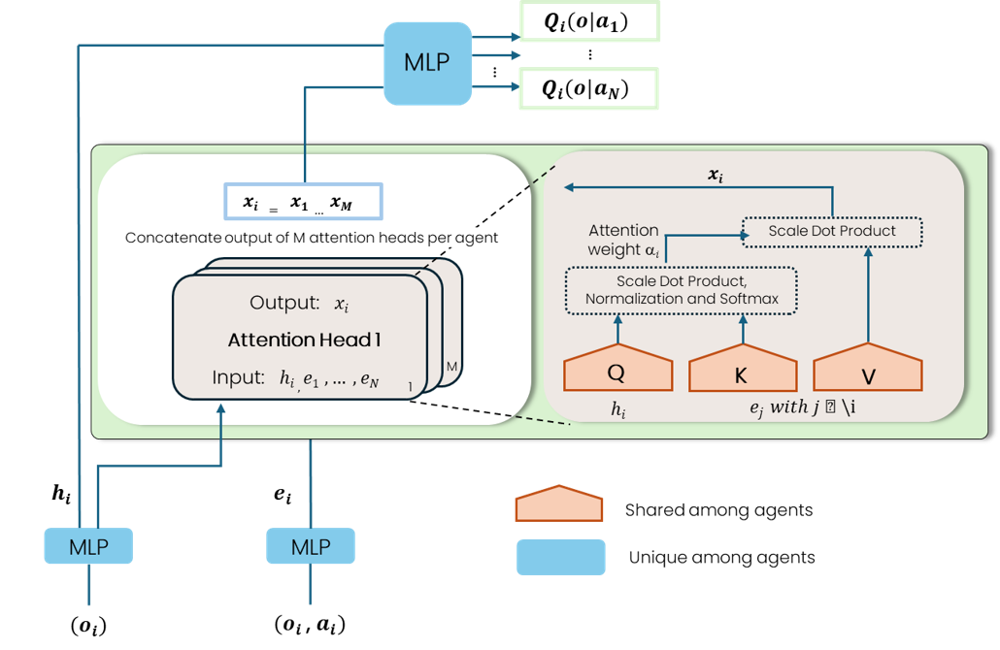

# AAC-MADRL: Actor-Attention-Critic Multi-Agent DRL

This repository provides training and deployment scripts for three controllers within the **CityLearn** environment:

- **AAC-MADRL** — *Actor-Attention-Critic Multi-Agent DRL*: a novel attention-based multi-agent actor–critic method for district-scale demand-side management (DSM).
- **SAC**
- **MARLISA**

The code is associated with the paper:

> **S. Savino, T. Minella, Z. Nagy, A. Capozzoli (2025)**  
> *A scalable demand-side energy management control strategy for large residential districts based on an attention-driven multi-agent DRL approach*, **Applied Energy**.  
> See the **Citation** section for details.
marli
---


AAC-MADRL is an **attention-driven, discrete-action, multi-agent actor–critic algorithm** tailored for energy flexibility control at the district level. 

Key characteristics:

- **Paradigm**: follows **Centralized Training with Decentralized Execution (CTDE)**.
- **Actors (πᵢ)**: one per building, with  **discrete probability distribution over actions**.  
  Building devices (domestic hot water storage, electrical storage, heating/cooling systems) are represented as **discretized action classes** (e.g., charging/discharging levels, on/off modulation)
- **Centralized Critic (Q)**: during training, a single critic evaluates joint state–action tuples \(Q(s, a_1, \dots, a_N)\).  
  - It incorporates a **multi-head attention mechanism** to dynamically weight the influence of other agents’ states and actions.  

This makes AAC-MADRL suitable for large residential districts, where **coordination** is crucial.

### Critic Architecture


*The centralized critic computes Q-functions for each agent by embedding each agent’s state–action pair, applying a multi-head attention module to extract the most relevant inter-agent dependencies, and aggregating the attended features before the final Q-value regression layer.*


## Training Examples

### AAC-MADRL
```bash
python scripts/train_aac_madrl.py \
  --dataset-name data/TX_10_dynamics/schema.json \
  --episodes 12 --lr 1e-3 \
  --dhw-storage 21 --electrical-storage 21 --cooling-or-heating-device 21 \
  --sim-start 3624 --sim-end 4343 \
  --wandb off
```

### MARLISA
```bash
python scripts/train_marlisa.py \
  --dataset-name data/TX_10_dynamics/schema.json \
  --episodes 12 --lr 3e-4 \
  --sim-start 3624 --sim-end 4343 \
  --wandb off
```

### SAC
```bash
python scripts/train_sac.py \
  --dataset-name data/TX_10_dynamics/schema.json \
  --episodes 12 --lr 3e-4 \
  --sim-start 3624 --sim-end 4343 \
  --wandb off
```

### Optional: Weights & Biases (wandb) Integration

Training scripts support optional logging with [Weights & Biases](https://wandb.ai) for experiment tracking and visualization.

- By default, wandb is disabled (`--wandb off`).
- To enable it, provide your wandb project name:

```bash
# Example: run AAC-MADRL with wandb logging enabled
python scripts/train_aac_madrl.py \
  --dataset-name data/TX_10_dynamics/schema.json \
  --episodes 12 --lr 1e-3 \
  --dhw-storage 21 --electrical-storage 21 --cooling-or-heating-device 21 \
  --sim-start 3624 --sim-end 4343 \
  --wandb on \
  --wandb-project name of yout project \
  -- wandb-run-name name of youe run
```

## Deployment
```bash
python scripts/deploy_model.py \
  --dataset-anchor outputs/data/TX_10_dynamics/schema.json \
  --model-type AAC_MADRL \
  --lr 3e-4 --beta 0.0 --gamma 1 \
  --sim-start 3624 --sim-end 4343
```

This produce:

outputs/data/<DATASET_KEY>/obs/<algo>/...
  ├─ district_obs.csv
  ├─ obs_building_0.csv
  ├─ obs_building_1.csv
  └─ action_building_<i>.csv


### Notes on Reward Function and Hyperparameters

- Reward customization (beta, gamma):
The training scripts accept the parameters --beta and --gamma, which are used in the customized reward function proposed in the paper. 
However, the framework is flexible — any reward function available in CityLearn can be used. If no customization is needed, these parameters can be omitted.

- Learning rate (lr):
Empirical results demonstrated that a learning rate of 1e-3 provides stable and effective training for both AAC-MADRL and SAC, while 3e-4 for MARLISA in the CityLearn environment

- Discrete action classes:
For AAC-MADRL, discretizing device actions proved crucial for stability.
The paper shows that 21 classes for storage devices and 11 classes for heating/cooling devices yield the best trade-off between performance and stability.
These values can be tuned for other scenarios.

### Citation

If you use this repository or reproduce the results, please cite:

Savino S., Minella T., Nagy Z., Capozzoli A. (2025).
A scalable demand-side energy management control strategy for large residential districts based on an attention-driven multi-agent DRL approach.
Applied Energy. [https://doi.org/10.1016/j.apenergy.2025.125993]